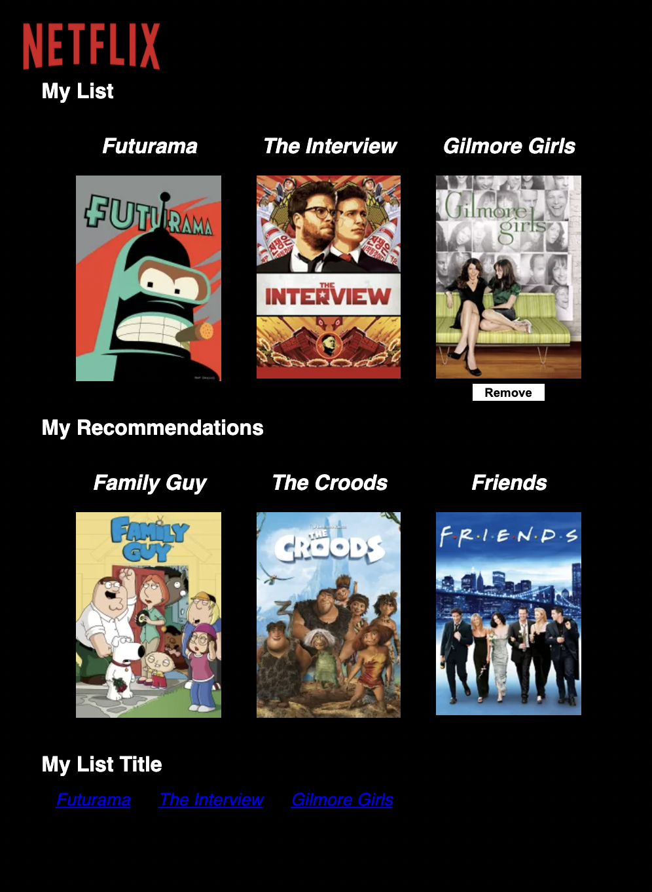

# Netflix Movie List App
  Getting started with Create React App

# Instruction
  ## After downloading the repository, Run this to start the project.
  Install modules:
  ``` npm install ```

  Build the project:
  ``` npm run build ```

  Run the project:
  ``` npm run start ```
  
  It will automaticaly direct you to the page. If not, try the following hosts.
  ``` http://localhost:8000 ```

# Demo Screenshot

